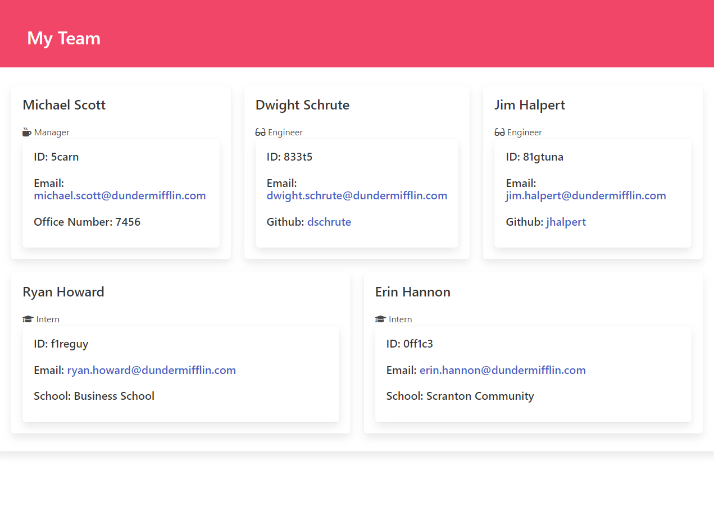

  # Team Profile Generator

  ## Description

  
This tool creates a profile of team members through user prompts.

  ## Table of Contents 
  * [Installation](#installation)
  * [Usage](#usage)
  * [Tests](#tests)
  * [Resources](#resources)
  * [Questions](#questions)

  ## Installation

  
Node and the Inquirer.js package are required to run this tool. 
   
  Clone the repository and run <code> node index.js </code> on a terminal from the root. Watch the video walkthrough for additional instruction.
 

  [Video Walkthrough](https://youtu.be/VF1bp4CWh3w)  

  ## Usage

  
 Follow the prompts to enter the Manager information, from there a menu is presented with options for Engineer or Intern. Selecting either will prompt the appropriate information gathering questions and each can be selected as many times as needed. Once satisfied, selecting the Finish option will generate a stylized, mobile-first HTML file.

  
  

  ## Tests

  <code> npm run test </code>

  ## Resources

  To create the HTML, the tool utilizes the following resources:

  * [Node](https://nodejs.org/en/)
  * [Inquirer](https://www.npmjs.com/package/inquirer)

  To stylize the HTML, the tool utilizes the following resources:

  * [Bulma](https://bulma.io/)
  * [Font Awesome](https://fontawesome.com/)

  ## Questions 

  Please direct questions to my github at [esimondet](https://github.com/esimondet)
  or email [edison.simondet@gmail.com](edison.simondet@gmail.com).

  ###### Made using [Readme Generator](https://github.com/esimondet/readme-generator)!